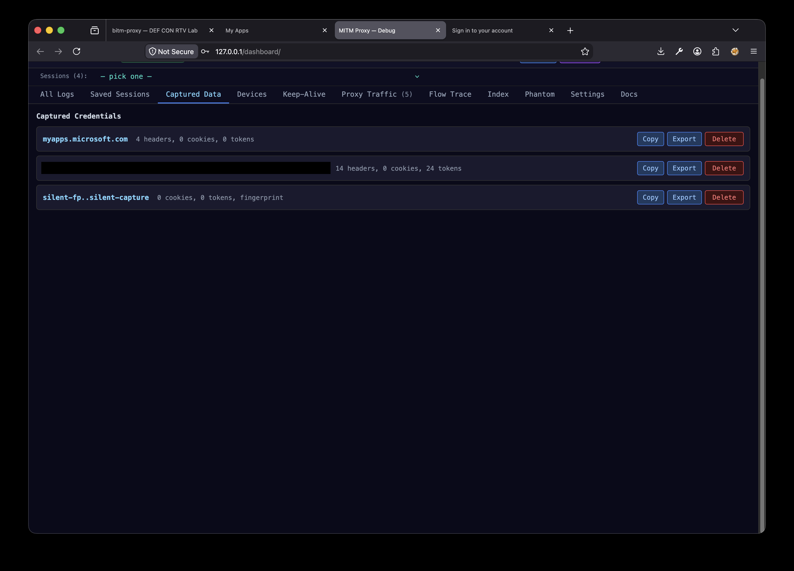
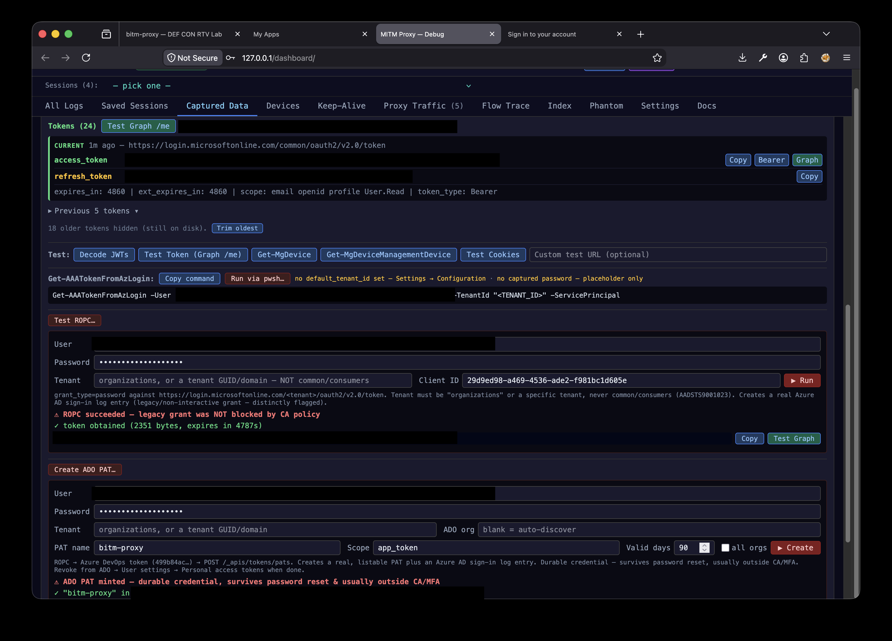
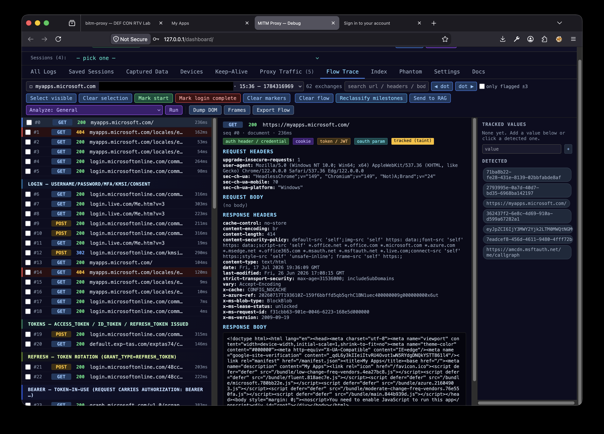
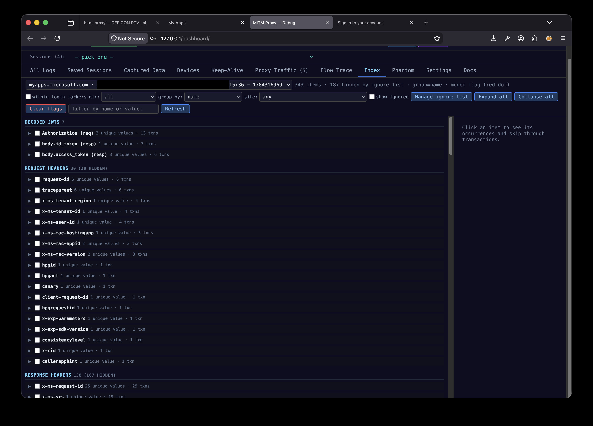
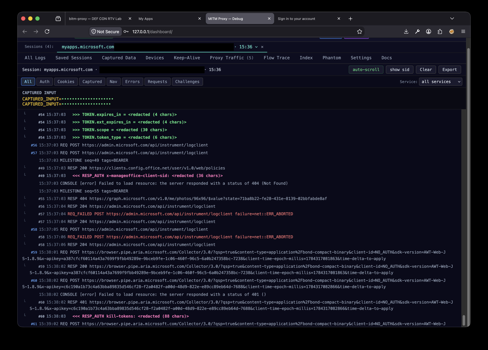

# BITM Proxy

Remote-browser login + API testing tool. Runs a headless Playwright
browser, a control-plane dashboard, a BITM auth proxy, and a Go daemon
in one process tree.

| Port | Service | Purpose |
|------|---------|---------|
| 8091 | Main app | Browser + login UI |
| 8092 | Debug dashboard | Live logs, config, flow trace, AI analysis |
| 8000 | RAG API | Burp extension endpoint |
| 8085 | Reverse proxy | Authorized pentest use only |
| 3128 | Auth BITM | Forged-CA BITM for auth capture |
| 3129 | Test proxy | Go pass-through |

---

## Dashboard

The control-plane dashboard on `:8092` surfaces everything the proxy and
the hosted browser session capture. The screenshots below are from the DEF
CON RTV lab against a disposable test tenant — tenant identifiers and token
previews are redacted.

### Captured Data



Every captured session, grouped by site and user, with live header / cookie
/ token counts and per-record Copy / Export / Delete.



Expand a record to replay captured tokens against Microsoft Graph, run a
**ROPC** legacy-auth check (does the tenant block `grant_type=password`?),
or mint an **Azure DevOps PAT** straight from captured creds — each a
one-click test with the result inline.

### Flow Trace



The full request/response timeline for a login, auto-grouped into milestones
(LOGIN → TOKENS → REFRESH → BEARER). Click any exchange for its headers and
body; tracked values are tainted and followed across requests.

### Index



Every request/response header and decoded-JWT claim across the session,
grouped by name with unique-value and occurrence counts — jump straight to
where each value appears.

### All Logs



The live event stream — captures, token issuance/refresh, requests, and MFA
challenges. Captured inputs are masked and token values redacted in the UI
by default.

---

## Quick start — `run-local.sh`

Simplest way to get running. Works on macOS and Linux in the foreground;
prompts for any missing system deps. Data stored in your home directory.

```bash
./run-local.sh                 # interactive
./run-local.sh --install-deps  # non-interactive, auto-yes to setup prompts
./run-local.sh --rebuild       # wipe venv / playwright / frontend / go caches
```

Ports are the same as the service install. Data defaults to
`~/Library/Application Support/BitmProxy/` on macOS and
`~/.local/share/BitmProxy/` on Linux.

---

## Docker

```bash
docker rm -f bitm-proxy && docker build -t bitm-proxy .
docker run -p8091:8091 -p8092:8092 -v bitm-proxy-data:/data -it bitm-proxy
```

Custom CA certs (Zscaler, corp proxy): drop `.crt`/`.pem` files in
`certs/` before building, or mount them at runtime:

```bash
docker run -p8091:8091 -p8092:8092 \
    -v bitm-proxy-data:/data \
    -v /path/to/extra-certs:/certs \
    -it bitm-proxy
```

Builds and runs on arm64 (Apple Silicon) as well as amd64 — verified live,
not just per docs. Chromium and Firefox both have real arm64 Linux builds
and work normally; Microsoft Edge does not (Microsoft has never shipped
one), so `edge-real` mode silently falls back and stays disabled on arm64.
Set `browser_type` to `firefox` in Configuration (or via
`/api/config`) for a genuine Gecko engine instead of a Chromium UA spoof.

---

## DEF CON RTV Lab — `docker-compose.yml`

A separate, more locked-down deployment: nginx (TLS termination, landing
page) fronts the app, so visitors never install a CA cert or configure a
proxy — they drive a hosted Playwright session through the browser instead.
Two safety allowlists (`proxy_allowed_hosts`, `phantom_join_allowed_domains`,
both empty/unrestricted by default) scope the whole deployment to a specific
tenant, enforced in code, not just documented as policy.

```bash
./run_demo.sh          # macOS / Linux
.\run_demo.ps1         # Windows
```

Defaults to `https://127.0.0.1/` — loopback-only, self-signed cert, safe to
run as-is. `--public`/`-Public` widens the bind to `0.0.0.0` for a real
public instance (only after populating the allowlists). See
[`docs/DEFCON-LAB-SETUP.md`](./docs/DEFCON-LAB-SETUP.md) for the full
runbook: tenant setup, both allowlists, the reset procedure, and
cross-platform notes (this stack is verified working on arm64 Linux/macOS,
not just amd64).

---

## Windows

### Portable (no installer)

Requires Python 3.10+ and Node.js 18+ on PATH.

```
windows\quick-start.bat
```

### Full installer (PowerShell, admin)

Installs to `%LOCALAPPDATA%\BitmProxy`, adds Start Menu + Desktop
shortcuts.

```powershell
powershell -ExecutionPolicy Bypass -File windows\install.ps1
```

### Windows service

Runs on boot, no console, survives logoff. Requires Administrator.

```powershell
powershell -ExecutionPolicy Bypass -File windows\service-install.ps1
Start-Service BitmProxy
Get-Service  BitmProxy
```

Log file: `%LOCALAPPDATA%\BitmProxy\data\service.log`.

Uninstall: `powershell %LOCALAPPDATA%\BitmProxy\uninstall.ps1`.

---

## Ubuntu — Install as a service (persistent)

For long-running operations or production deployments. Tested on Ubuntu 22.04
and 24.04. One command; idempotent; creates a dedicated service user, installs
systemd unit, starts on boot.

```bash
git clone https://github.com/fd22vrsfpv-star/bitm-proxy.git
cd bitm-proxy
sudo ./install-ubuntu.sh
```

### What it does

1. Installs apt packages: `python3.12`, `python3-venv`, `nodejs` 20,
   `go` 1.22.10 (pinned), `build-essential`, `openssl`, Chromium runtime libs.
2. Installs PowerShell (`pwsh`) via Microsoft's apt repo + the `Az.Accounts`
   PowerShell module (system-wide). Required for AAA runner endpoints.
   Best-effort — the proxy still runs if these fail.
3. Creates the `bitm-proxy` system user (no shell, home = `/var/lib/bitm-proxy`).
4. Syncs this checkout to `/opt/bitm-proxy`, builds the Python venv,
   installs Playwright Chromium + Firefox + WebKit (and the Edge channel
   best-effort), builds the frontend, builds the Go daemon.
5. Writes `/etc/systemd/system/bitm-proxy.service` (hardened:
   `ProtectSystem=full`, `ProtectHome=true`, `PrivateTmp=true`).
6. `systemctl enable --now bitm-proxy`.

### Manage the service

```bash
systemctl status  bitm-proxy
systemctl restart bitm-proxy
systemctl stop    bitm-proxy
journalctl -u     bitm-proxy -f
```

### Data locations

| What | Path |
|------|------|
| App code | `/opt/bitm-proxy` |
| Data (sessions, credentials, screenshots) | `/var/lib/bitm-proxy` |
| Custom CA certs | `/opt/bitm-proxy/certs` |
| API key (plaintext) | `/var/lib/bitm-proxy/.api_key_plaintext` (mode 0600) |
| Logs | `journalctl -u bitm-proxy` |

### Environment overrides

Set before invoking the installer:

```bash
# Bind on all interfaces (LAN exposure — put nginx + TLS in front).
sudo BIND_HOST=0.0.0.0 ./install-ubuntu.sh

# Custom paths and user.
sudo APP_DIR=/srv/bitm DATA_DIR=/srv/bitm-data \
     SERVICE_USER=bitm ./install-ubuntu.sh
```

### Uninstall

```bash
sudo ./install-ubuntu.sh --uninstall   # keeps $DATA_DIR
sudo ./install-ubuntu.sh --purge       # removes $DATA_DIR too
```

### Exposing to LAN

The installer binds `127.0.0.1` by default. If you expose `8091`/`8092`
externally, front them with nginx + TLS + basic-auth. A template lives
at `pages/nginx.conf.example`.

---

## External credential ingest — `POST /api/capture/external`

Pentester-side tooling (Burp extension, a separate runner, anything
that obtains credentials outside the `:3128` BITM path) can push them
into the same store + Slack channel as in-band captures.

**→ See [`docs/EXTERNAL_CAPTURE_SETUP.md`](./docs/EXTERNAL_CAPTURE_SETUP.md) for complete setup guide with file locations, lander deployment, log formats, and troubleshooting.**

Configure once:

- **Token** — Configuration tab → *External capture* (or set
  `EXTERNAL_CAPTURE_TOKEN` in the service env, or drop the value in
  `config/external_capture_token.txt`). Empty = endpoint returns 404.
- **IP allowlist** — Configuration tab → *External capture* →
  `external_capture_allowed_ips`. Loopback is always allowed; remote
  callers must be on this list.

Then POST a JSON bundle (`site_id` required; everything else optional):

```bash
curl -s -X POST http://127.0.0.1:8092/api/capture/external \
    -H "Authorization: Bearer $EXTERNAL_CAPTURE_TOKEN" \
    -H "Content-Type: application/json" \
    -d '{
      "site_id": "microsoft",
      "user": "alice@example.com",
      "source_url": "https://login.microsoftonline.com/...",
      "username": "alice@example.com",
      "password": "...",
      "tokens": [{"name": "access_token", "value": "eyJ..."}],
      "cookies": [{"name": "ESTSAUTH", "value": "...",
                    "domain": ".login.microsoftonline.com"}],
      "captured_inputs": {},
      "notes": "captured by burp ext"
    }'
```

The endpoint writes through `credentials_store` (encrypted at rest
when `CREDENTIAL_PASSPHRASE` is set, same as in-band captures) and
fires `notify_slack_capture` so the Slack capture channel sees external
ingests identically. `X-Capture-Token` is accepted as an alternative
header. Per-field reference: `docs/SESSIONS.md` → *External Capture*.

### Lander pages — `pages/lander.html` and `pages/login.html`

Two variants ship in the repo. Both gather form inputs + device
fingerprint (UA, Sec-CH-UA-* client hints via
`navigator.userAgentData.getHighEntropyValues`, screen, viewport,
timezone, languages, hardware concurrency, WebGL renderer/vendor) +
same-origin cookies + localStorage / sessionStorage, POST to
`/api/capture/external` with `keepalive: true`, and redirect to a
configured real login URL so the flow looks unbroken. Same wire
shape; different audiences.

- **`pages/lander.html`** — *engineering-documented*. The
  top-of-file comments spell out the deployment hazards (token
  visibility, CORS requirements, IP-allowlist semantics). Use this
  to learn the shape and understand the moving pieces.
- **`pages/login.html`** — *deployment-ready*. Same JSON body and
  POST flow, but the visible page source uses short neutral
  identifiers (`S.k`, `S.e`, `ctx()`, `rs()`, `rc()`) so a target
  viewing source sees only a login form that records session
  analytics. Edit the four-field `S` block at the top:
  `g` = site_id, `k` = token, `e` = endpoint, `n` = next URL.

Hosting either variant:

1. **Same-origin** (no CORS setup needed): copy into `static/` on the
   proxy and open `http://<host>:8091/login.html` (or `lander.html`).
2. **Cross-origin** (separate believable domain): add the page's
   origin to `external_capture_cors_origins` (or set it to `*`),
   AND broaden `external_capture_allowed_ips` to cover the source IP
   range that will POST (often `0.0.0.0/0`, since those IPs aren't
   predictable). The bearer token + Origin allowlist are the real
   auth in this mode.
3. Restyle the form to match the engagement's pretext. The capture
   logic doesn't care what the page looks like.

The bearer token is embedded in page source for either variant —
use a single-purpose token and rotate it after the engagement.

### Test proxy landing page — `pages/proxy-3129.html`

The Go test proxy on `:3129` is a transparent pass-through HTTP/HTTPS proxy
(no BITM, no credential injection) — useful for A/B testing against the
Python BITM on `:3128` when debugging. The landing page provides quick
navigation links to both proxy ports and the dashboard.

**Access:**
```
http://<host>:3129/
https://<host>:3129/  (if TLS cert is configured)
```

The page auto-detects the hostname from the browser's URL and dynamically
generates proxy-configuration shortlinks:
- `:3129/proxy` or `:3129/3129` — direct to the test proxy
- `:3129/bitm` or `:3129/3128` — direct to the BITM auth proxy
- `:3129/dashboard` or `:3129/8092` — direct to the debug dashboard

Useful when you want to:
1. Compare BITM behavior `:3128` vs. transparent `:3129`
2. Verify proxy routing works without TLS BITM complexity
3. Test upstream connections without certificate interception

---

## Reading encrypted credentials

When `CREDENTIAL_PASSPHRASE` is set in the service environment, captured
sessions, cookies, and credentials are AES-256-GCM encrypted at rest.
Read them with:

```bash
sudo -u bitm-proxy \
    CREDENTIAL_PASSPHRASE='...' \
    /opt/bitm-proxy/.venv/bin/python /opt/bitm-proxy/read_creds.py
```

---

## Burp Suite integration — RAG findings bridge

`burp-extension/RagScanBridge.py` is a Burp Extender (Jython) extension that
syncs findings bidirectionally with the built-in RAG API on `:8000`
(`backend/rag_api.py`) — no external RAG Scan Stack backend required. It's
adapted from the RAG Scan Stack project's own extension of the same name;
the endpoints it calls
(`/health`, `/scope*`, `/engagements*`, `/findings/search`,
`/export/findings-exchange`, `/import/findings-exchange`) are implemented
here to match exactly.

- **Download**: Configuration tab → *RAG Scan Stack* → *Burp Suite* → **Download
  Burp extension** (streams `burp-extension/RagScanBridge.py` from
  `GET /api/rag/burp-extension/download`).
- **Install**: Burp Suite → Extender → Add → Extension Type: Python (Jython)
  → select the downloaded file. Default API URL is
  `http://localhost:8000` (plain HTTP — the built-in RAG API doesn't
  terminate TLS itself).
- **Not supported** against the built-in RAG API: the extension's SOCKS
  tunnel-node proxy routing and Follow-Up Queue tabs call `/nodes` and
  `/burp-queue`, which are RAG Scan Stack-specific infrastructure this
  project doesn't implement — using them here just logs a connection
  error, not a crash.

## Architecture

Three docs, in increasing depth:

- **`docs/ARCHITECTURE.md`** — component map: ports, backend modules,
  frontend layout, where each surface (`:8091`, `:8092`, `:3128`,
  `:8000`, `:8085`, `:3129`) lives and what it owns.
- **`docs/SESSIONS.md`** — every session type (Playwright, sub-session, host
  capture, credentials, cookies, flow trace, dashboard WS, auth-proxy
  BITM, worker pool, **device profile**), every config variable, every
  environment variable, and the data-directory layout.
- **`docs/PROXY_DEEP_DIVE.md`** — on-the-wire path of `:3128`: forged CA,
  per-host cert generation, capture, injection, `curl_cffi` upstream
  TLS impersonation, the device-probe sentinel.
- **`docs/AUTH_FLOWS.md`** — operator guide for adding/troubleshooting
  auth-flow milestones (LOGIN → AUTH CODE → TOKENS → SESSION → PRT).
  Covers the diagnostics emitted by **Reclassify milestones**, how to
  capture a representative flow, how to read the milestone shapes
  out of an Export Flow JSON, and how to extend `config/sites.yaml`
  for a new IdP without code changes.

### Device profiles (Devices tab)

The dashboard at `:8092` has a **Devices** tab that lets you save a
reusable bundle of fingerprint + (optional) probed JS signals +
(optional) per-host credentials. You can:

- **Register from capture** — pick a host you've browsed through
  `:3128`. Three modes: *passive* (snapshot only), *active probe*
  (the next request through `:3128` returns a one-shot synthetic page
  that posts back timezone, screen, viewport, languages, etc), or
  *probe + cred snapshot* (also bundles cookies / `Authorization` /
  CSRF / localStorage / sessionStorage).
- **Register from `:8091` session** — when the operator is logged in
  inside the canvas at `:8091`, click **Register device** in the nav
  bar. Snapshots UA + JS signals + (optionally) cookies + storage
  from the live Playwright session. No probe needed — values are
  read live via `page.evaluate` + `storage_state()`.
- **Add device** — pick a preset (iPhone 15 Safari, Pixel 8 Chrome,
  Win11 Edge, macOS Safari, Win10 Chrome) or paste a custom UA in the
  Advanced form. Locale, timezone, viewport, mobile/touch, engine
  family, channel, and `curl_cffi` impersonate tag are all editable.
- **Launch** — opens a fresh Playwright session at `:8091` pre-shaped
  by the profile: same UA + Sec-CH-UA-* hints, same viewport / DPR /
  locale / timezone, plus already-authenticated cookies/storage when
  the profile carries them. The IdP sees a coherent device.

All device events log to the `devices` category — filter the All Logs
view in the dashboard or grep `journalctl -u bitm-proxy -g DEVICE_`.

Mechanism + storage in `docs/SESSIONS.md` → *Sessions → Device profile*.

## Credits

This project is glue around the work of others who did the hard part
first. The Azure/Entra attack chain in particular stands on:

**Offensive tooling**

- **[ROADtools](https://github.com/dirkjanm/ROADtools)** — Dirk-jan
  Mollema. `roadlib` / `roadtx` / `roadrecon` power the entire Phantom
  Join chain: device-code → DRS, phantom device registration, PRT
  minting, and tenant enumeration.
- **[AbuseAzureAPIPermissions](https://github.com/hagrid29/AbuseAzureAPIPermissions)**
  — Hagrid29. Vendored under `tools/AbuseAzureAPIPermissions/`; the
  `Get-AAA*` Graph recon/abuse functions behind the dashboard's AAA
  runner.
- **[AADInternals](https://github.com/Gerenios/AADInternals)** — Dr.
  Nestori Syynimaa (@DrAzureAD). Bundled inside AbuseAzureAPIPermissions
  (the `AADIntAccessToken/` module) for its token / WS-Trust primitives.
- **[TokenTacticsV2](https://github.com/f-bader/TokenTacticsV2)** —
  Fabian Bader. Prior art for token manipulation (see
  `tools/README_Phantom.md`).

**Research / prior art**

- **Cyderes "Howler Cell"** research — *"One Password, No Device, Full
  Tenant"* — the phantom-join Conditional Access bypass technique
  `tools/phantom_join.py` is based on.
- **Microsoft** — Storm-2372 device-code phishing analysis; and
  **[MITRE ATT&CK](https://attack.mitre.org/)** for the technique mapping.

**Browser / proxy / TLS**

- **[Playwright](https://playwright.dev)** (Microsoft) — hosted browser
  sessions.
- **[curl_cffi](https://github.com/lexiforest/curl_cffi)** +
  **[curl-impersonate](https://github.com/lwthiker/curl-impersonate)** —
  JA3/JA4 TLS-fingerprint impersonation on the `:3128` upstream leg.

**Frameworks & runtime**

- Backend: **[FastAPI](https://fastapi.tiangolo.com)**, **Uvicorn** /
  **Starlette** / **[httpx](https://www.python-httpx.org)** (Encode),
  **Pydantic**, **[cryptography](https://cryptography.io)** (PyCA),
  **PyYAML**, **msgpack**.
- Frontend: **React** (Meta), **Vite**, **[TanStack
  Query](https://tanstack.com/query)**, **[Tailwind
  CSS](https://tailwindcss.com)**, **[lucide-react](https://lucide.dev)**.
- Infra: **Docker** / **Docker Compose**, **nginx**, **PowerShell** +
  the **Az.Accounts** module (Microsoft), and optional local-LLM flow
  analysis via **[Ollama](https://ollama.com)** with open models
  (Llama · Gemma · Qwen).

**Integrations**

- The `burp-extension/RagScanBridge.py` Burp extension is adapted from
  the **RAG Scan Stack** project's extension of the same name.

All third-party tools remain the property of their respective authors
and are used here under their own licenses. This project is provided for
authorized security testing and research only.
